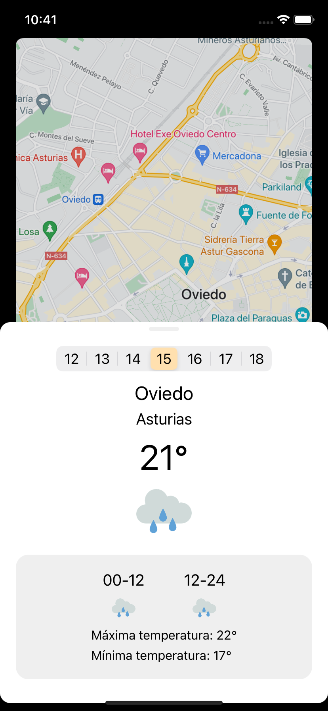

Seresco Weather Utils iOS
=======

A weather library for iOS using AEMET data

<p float="left">
  
  
  
  
</p>


Usage
--------

e.g. Displaying Weekly Weather Info

```swift
import SerescoWeatherUtils


let meteorologyUtils = MeteorologyUtils()

func openWeatherWeeklySheet() {
    meteorologyUtils.currentViewController = self
    meteorologyUtils.openMeteorologyPanel(meteorologyType: .WEATHER_WEEKLY, coordinate: CLLocationCoordinate2D(latitude: 43.361231, longitude: -5.848566,))
}
```

Installation
--------

In your `Podfile`:

```ruby
source 'https://github.com/CocoaPods/Specs.git'

use_frameworks!

target 'TARGET_NAME' do
    pod 'SerescoWeatherUtils', '~> 0.0.1'
end
```

Replace `TARGET_NAME` and then, in the `Podfile` directory, type:

```bash
$ pod install
```
